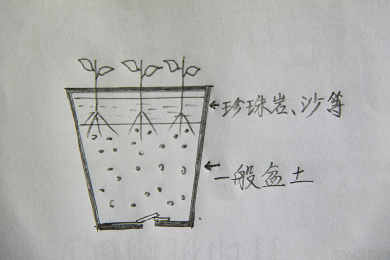

# 桂花扦插方法

#### 桂花品种选择

  * 建议选择**佛顶桂**
  * 金桂等其他品种树形高大不太适合盆栽，当然剪得好也是一样的，但不如佛顶桂花期长
  * 同时佛顶桂又比一般四季桂花量大、香气浓，所以佛顶桂很适合盆栽

#### 时间选择

  * 桂花扦插时间一般在**5、6月**，新枝半木质化时进行成活率相对高一些
  * 20度左右或稍高生根比较快
  * 春、夏、秋都可以扦插，不过盛夏要注意覆盖后高温闷热

#### 枝条选择

  * 插条老嫩适中，太嫩易烂，太老生根缓慢
  * 选取当年生，**半木质化新枝**
      * 新枝下半部有些变老像木头，已开始由绿变黄褐色
      * 上半部还较嫩
  * 一个老枝同时会发出两支以上的新枝，每支新枝都可以单独作插条。

#### 剪枝

  * 2-3节即可，不要太长，大概**10厘米**左右
  * 如果太长了就将上面剪掉一些即可，不一定带顶芽，一叶一芽都可以插。
  * 下方斜切（稍斜）
  * 切口要**光滑**
  * 留2-3片叶就好，其余摘掉以利降低蒸腾作用

#### 扦插基质

  * 普通方法
  
    * **珍珠岩**
    * 盆大的话装入小半盆基质，盆小视情况而定
    * 保持基质深度不小于10厘米

  * 扦插介质分层扦插法（推荐）

    * 目的
        * 避免插在土里易感染
        * 解决插在珍珠岩等无机介质里面生根后移栽不及时，缺乏养分的问题
        * 待小苗根须发达、生长健壮后再移栽，避免刚生根后移栽容易伤根夭折的问题
 
    * 盆中扦插介质分上下两层
        
    * 上层
        * 厚约5厘米
        * 珍珠岩、蛭石、河沙等任选1种
        * 枝条插在这里面不易感染

    * 下层
        * 一般为**不加肥**盆土
        * 小苗生根后经过一段时间的生长，新根很快会扎到下部土壤中获取养分

    * 图示  
        

#### 插入基质以及浇水

  * 先将基质浇足水
  * 珍珠岩做基质浇水要用**细喷壶**，水流不能太急太大，用杯子等浇水的话水流太粗，容易将珍珠岩冲跑且浇不均匀
  * 用小木棍打孔将插条插入，深度为插条的三分之一
  * 随后浇透水

#### 覆膜

  * 目的
      * 覆膜是很**关键**的措施，其目的就是**减少叶面水分蒸发**，避免萎蔫，确保成活率

  * 方法
      * 如插条高度未超过盆口，可直接覆膜或盖上玻璃密封
      * 若超出盆面，可搭小拱棚或置入大容器中密封  
        * 图示1 - 放在大桶中  
          
        * 图示2 - 使用透光材质盖上密封（比如有机玻璃）  
          
  
#### 通风  

  * 每天或隔几天揭开一小会通通风，如全部揭开通风几分钟就行了
  * 打开覆盖物不要过勤，否则会影响成活
  * 生根后就可以逐步打开薄膜，不要一下子全部打开，要给小苗一个适应过程
  * 通风后叶面喷点雾

#### 浇水

  * 因扦插时基质浇过透水，腹膜后不易蒸发所以也不容易干，不需要过多浇水
  * 但要保持湿润，看见基质有些偏干就要马上浇，否则影响成活率

#### 放置位置及阳光照射

  * 室外阳光直射不到的明亮处(**散射光**)
  * 期间不要阳光直射，否则覆膜后温度相当高，插条会被蒸死

#### 生根  

  * 如此**1个月**之后，插条就会生根，小苗子诞生了
  * 轻轻地提一下，感觉很有抓力就是生根了
  * 确认生根后，准备移栽上盆正常养护
      
      
      
      

#### 注意事项总结

三不原则
  
  * 不拔起查看生根情况
  * 不施肥
  * 不使用生猛浇水动作冲倒或冲动插条

##### 扦插方法适用范围

这种扦插方法适应绝大部分花卉，特别是一些不易生根的木本花卉。

# Links

* [目录](list.md)
* 上一节：[序](00.md)
* 下一节：[生根后的移栽](02.md)