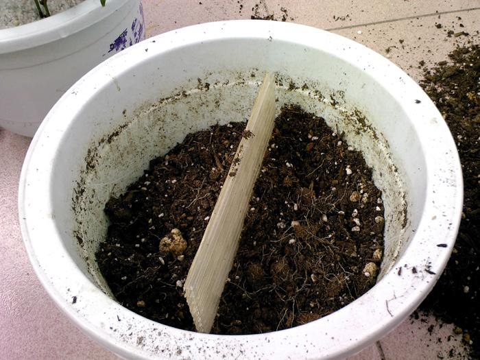
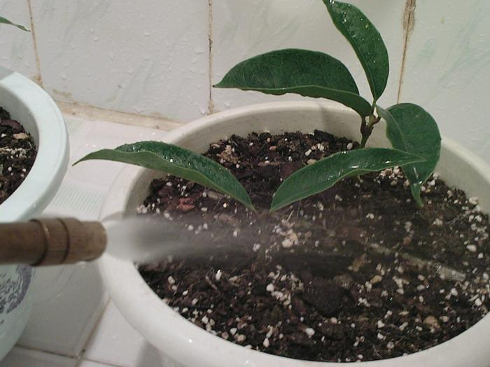

# 生根后的移栽

#### 动作要领
  
  * 小苗根须太嫩移栽时一定要小心
  * 先挖个小坑将苗子轻轻放入
  * 在掩土时要一只手**提住**苗子，一只手慢慢掩土
    * 提住苗子是为了在掩土时不让它下沉，否则这一沉嫩根就会折断

#### 土

  * 换盆时土球不要弄散，但土球外围要用细木棍戳松一点点，便于新土与旧土球融合
  * 良好的盆土是生长的基础，盆土不好根部不旺难以生长健壮
  * 盆土一定要**疏松透气不积水**，要有良好的**保水性**，不能浇水就泥泞、干时就发燥，要**富含腐殖质**，具有良好的**团粒结构**  
  * 本次移栽使用的土
    * 主要包括种过兰花的土，粗草炭，植金石，蛇木等
    * 长大后再换大盆可以用腐殖质含量高的园土加腐叶土
    * 新根**经不起肥料**，用**旧盆土**养护，以利发根成活  
      

#### 盆

  * 盆的种类
    * 养花**瓦盆**最好，外面套个漂亮的盆可以两全其美
    * 最好不要使用细瓷盆，很不利于透气，浇水后盆土长时间不干植株难以生长旺盛
    * 如果必须用瓷盆那么盆底要多垫一些瓦片之类的东西，使其排水通畅
  
  * 盆的大小  
    * 苗小用大盆不好，盆土不易干，容易烂根
    * 用20厘米口径盆，一盆种2苗
    * 中间隔开避免两株苗子根须缠绕，便于今后分栽时少伤根  
      
      

#### 浇水

  * 栽好浇定根水也要防止苗子下沉折断根须
  * 根不多，摇摇晃晃的，只好用**喷雾器**慢慢浇水，怕冲倒了  
    

#### 缓苗

  * 移栽后的小苗暂时避免阳光直射，放在阴凉处缓苗一段时间
  * 缓苗一般至少十天半月

#### 施肥

  * 在缓苗期后新叶没有正常生长以前，**不要**急于施肥
  * 第一次施肥也要**清淡**
  * 一年内幼苗待移栽成活发出的新芽展叶为绿色后要薄肥勤施

#### 整形修剪

  * 移栽后苗子小，先不急修剪，让它自由生长
  * 待一年内幼苗待移栽成活发出的新芽展叶为绿色后，选留位置合适的三枝左右健壮枝条为主枝，其他弱小枝条一概去掉，形成良好的株型骨架
  * 第二年春季发芽前将各主枝短剪，这样会萌发出许多新枝，植株矮而壮，株型基本形成

# Links

* [目录](list.md)
* 上一节：[桂花扦插方法](00.md)
* 下一节：[小苗生长的图片](03.md)