# 第三章：小苗生长的图片

## 扦插生根  
  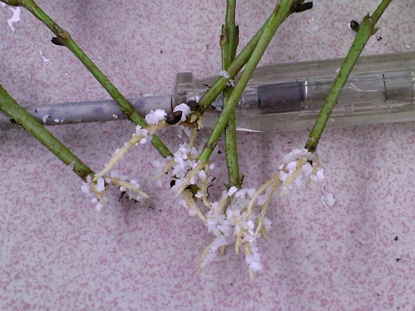  
    
  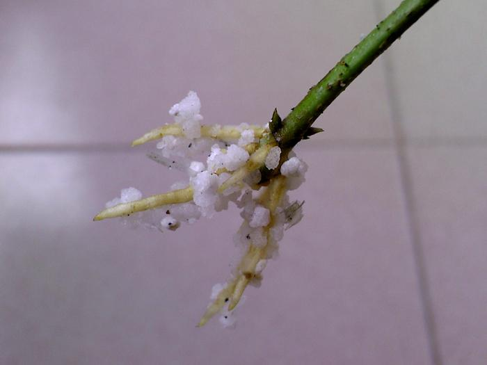  
  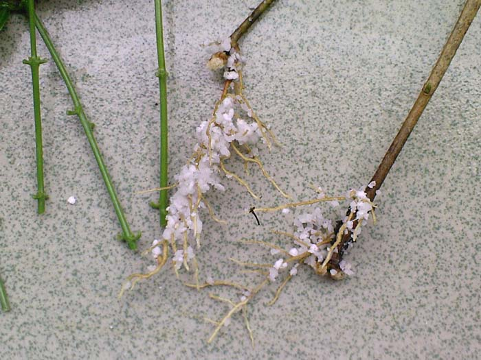  

## 生根后移栽
    
    
    
  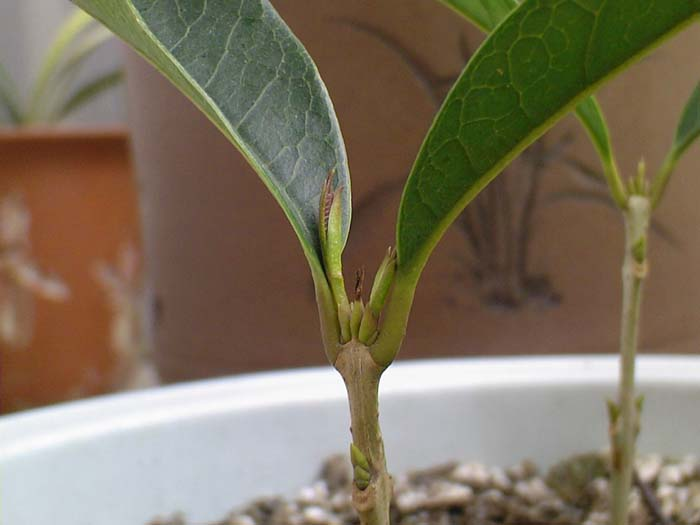  
  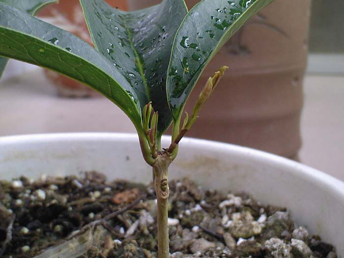 

## 温度高长得很快
  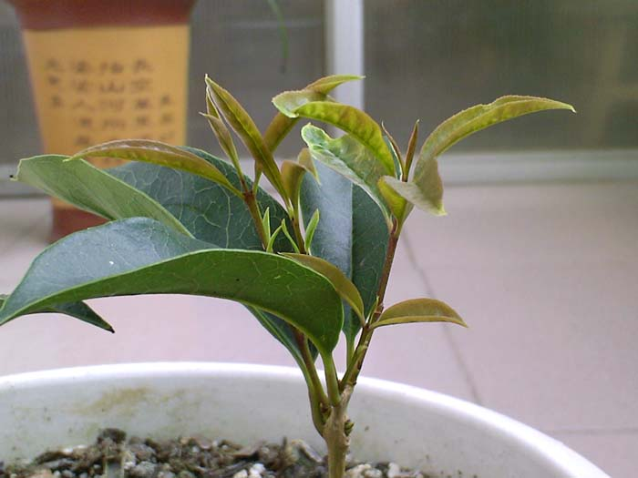  
  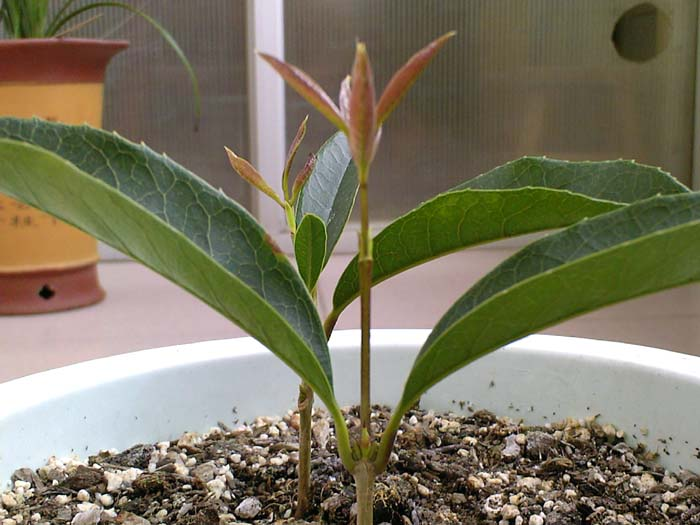  
  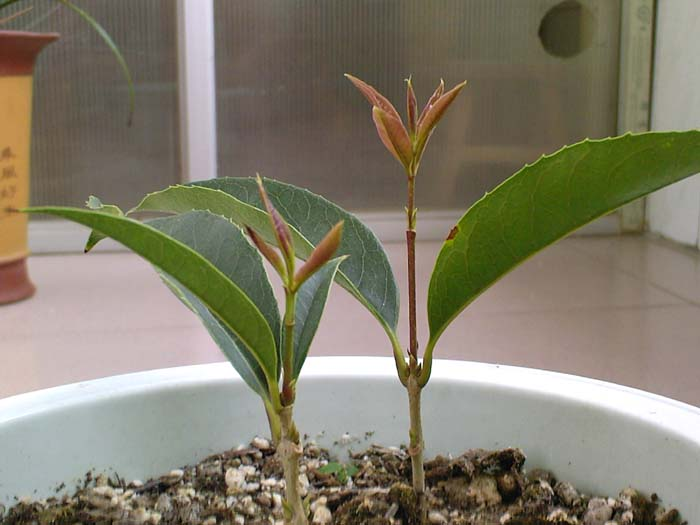  

## 当年9月份情况
    
    

## 当年10月份-含苞欲放
    
    

## 当年10月份，生根后发了新枝的开花少没发的开花多
  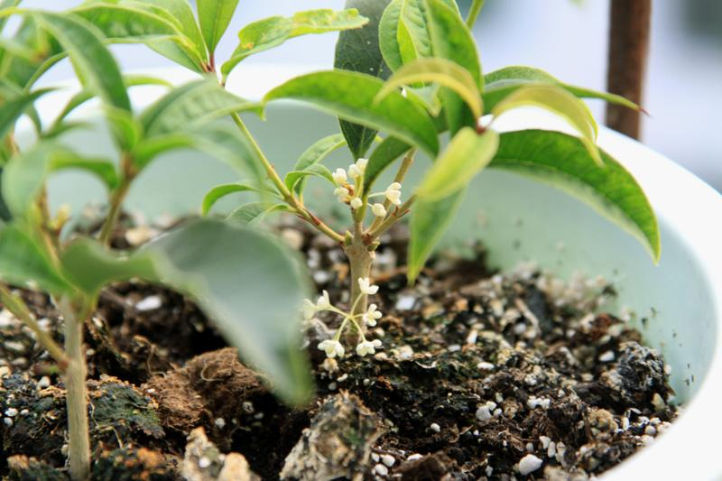  
    
    
  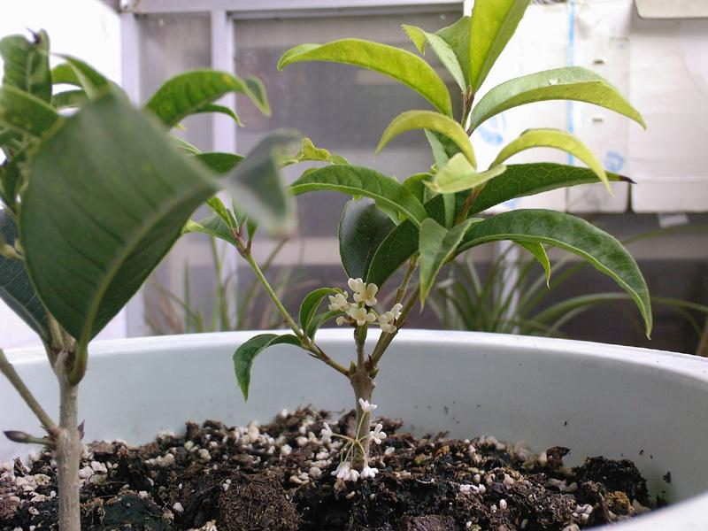  
    

## 今年这批小苗明年会很丰满并大量开花  
  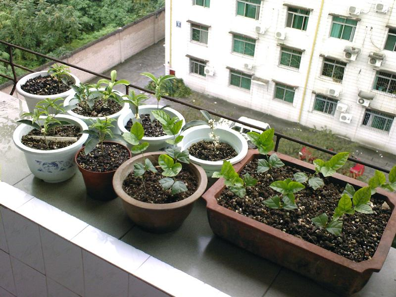  
  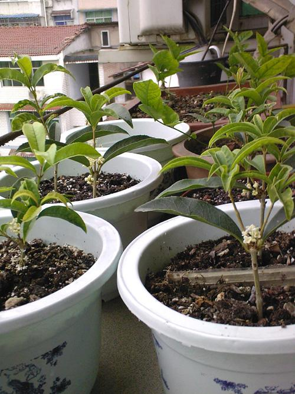  
  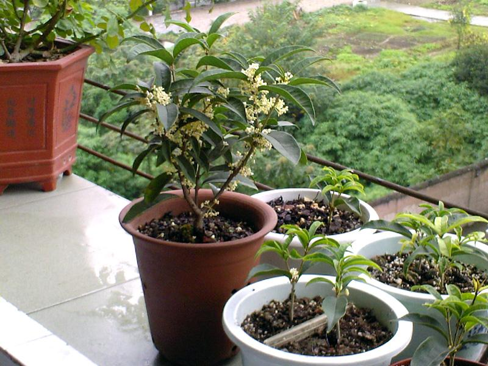  

## 去年的小苗有点挤今年分盆了
    
    
    
    

## 小苗现状（1年）
    
  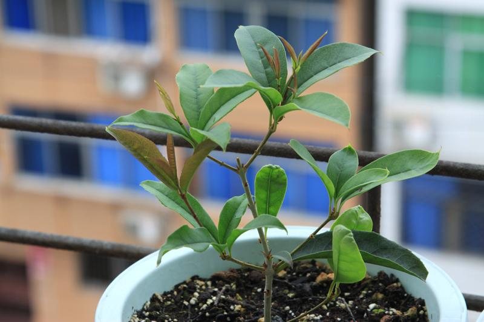  

## 2岁的佛顶桂
  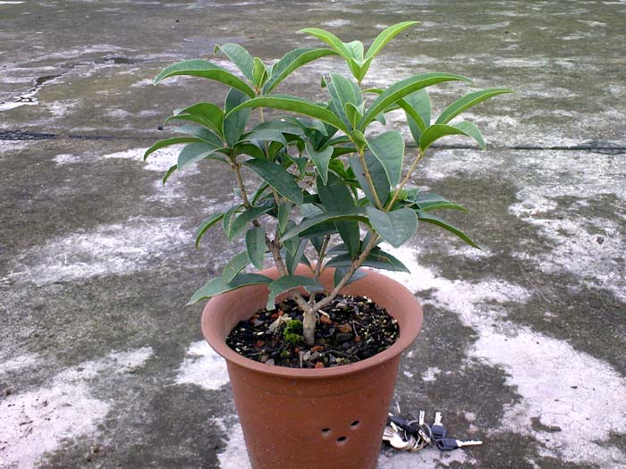  
  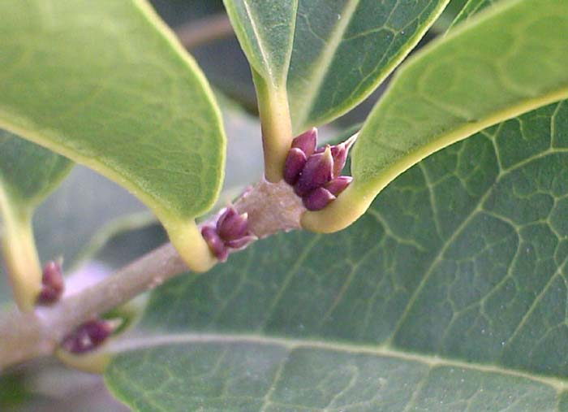  
    
    
  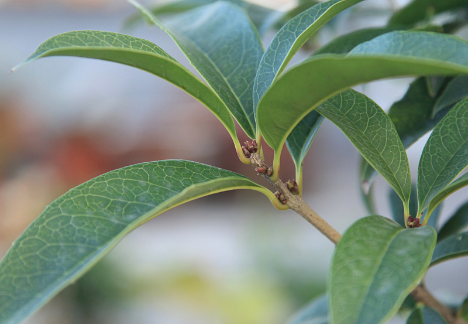  
    
    
    
    
    
  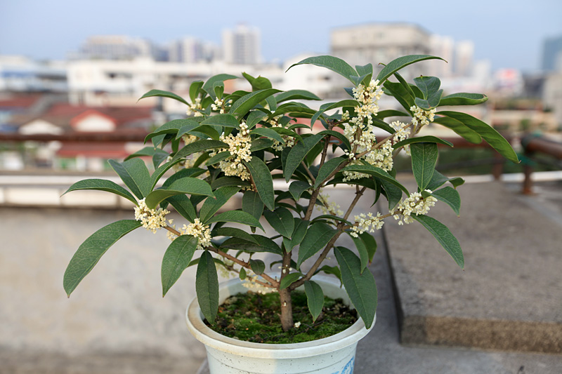  
    

## 母树开花-树冠80cm
    
    

## 母树根部萌发的两根枝条直径已经有7毫米
  

## Links

* [目录](content.md)
* 上一节：[第二章：生根后的移栽](02.md)
* 下一节：[第四章：Q & A](04.md)